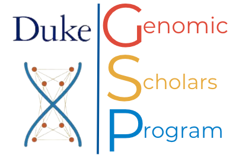

# Genomic Resource Modules 

## Goal

Our overall goal is to contribute in creating a diverse and dynamic genomics and genetics workforce. We aim to achieve this by training genetics and genomics enthusiasts from the greater Raleigh-Durham area, focusing on the historically marginalized communities.  

These modules enable researchers from diverse labs to use publicly available genetics and genomics data and resources to understand and advance investigation of their research questions. 

## Learning Objectives

- To understand how disease genes are discovered using genome-wide association studies and admixture mapping, using kidney disease and APOL1 as as example.
- To understand how population and family structure confound association studies, and apply solutions for modelling such relatedness.
- To learn approaches to study how a variant has an effect on gene expression and may result in a disease. 

## Content

This is a series spread across 3 days of 2 hour sessions with lectures and hands-on exercises. The schedule is given below: 

| Date    |	Time        |	Type     |	Topic                                                                      |
|---------|-------------|----------|-----------------------------------------------------------------------------|
| 1/23/25 |	2:30-3:00pm	| Lecture	 | Biological basis of chronic kidney disease disparity (FSGS: APOL1)          |
| 1/23/25 |	3:00-3:50pm	| Lecture	 | Gene Structure, Consequences of Variants, ML/AI in Research and Limitations |
| 1/23/25 |	3:50-4:30pm	| Exercise | spliceAI                                                                    |
| 1/30/25 |	2:30-3:15pm	| Lecture	 | GWAS and Population Structure |
| 1/30/25 |	3:15-4:30pm	| Exercise | Genotype and phenotype (using R studio) |
| 2/6/25  |	2:30-3:15pm	| Lecture	 | Gene Regulation and Non-coding |
| 2/6/25	| 3:15-4:30pm	| Exercise | DESeq Analyses (using R studio) |
| 2/13/25	| 2:30-3:00pm	| Lecture	 | From Genetic Discovery to Therapy (FSGS: APOL1) |
| 2/13/25	| 3:00-3:30pm	| Lecture	 | The role of APOL1 in Sickle Cell Nephropathy: a study using GWAS |
| 2/13/25	| 3:30-4:30pm	| Exercise | Comparative open chromatin analyses |

## Prework

Links to resources for pre-reading can be found in [Wiki](https://github.com/OchoaLab/genomic-modules/wiki)
